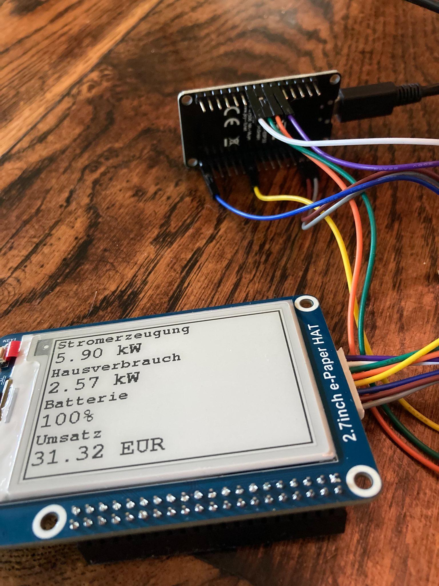

# E-Paper-Display-for-Kostal-Solar-Inverter

A small system to show basic information of the Kostal Pico IQ Solar Inverter. I use an ESP32 and a Waveshare 2.7 inch e-paper HAT b/w display. 

Cloned from [sonnenpelz](https://github.com/sonnenpelzx/E-Paper-Display-for-Kostal-Solar-Inverter/)



## Setup of local environment

Create a file named "secrets.h" at the root level of your project. Use the values below as a template and fill with your own actual secrets.
```cpp
// secrets.h

#ifndef SECRETS_H
#define SECRETS_H

const char* wifi_ssid = "MY_HOME_WIFI";
const char* wifi_password = "MY-SECRET-WIF-PASSWORD";
const char* inverter_host = "192.168.178.1";
const int inverter_port = 1502;

#endif
```

Using Arduino IDE make sure this file is uploaded too. (Menu Sketch/Add File ...)

## Wiring
- Busy + 27
- RST + 33
- DC + 25
- CS + 26
- CLK + 18
- BIN + 23
- GND + GND
- VCC + 3.3V

## Dependencies
- GxEPD by Jean-Marc Zingg, v 3.1.3 [github repo](https://github.com/ZinggJM/GxEPD).

## Known Issues/Wishes
- a date display would be nice
